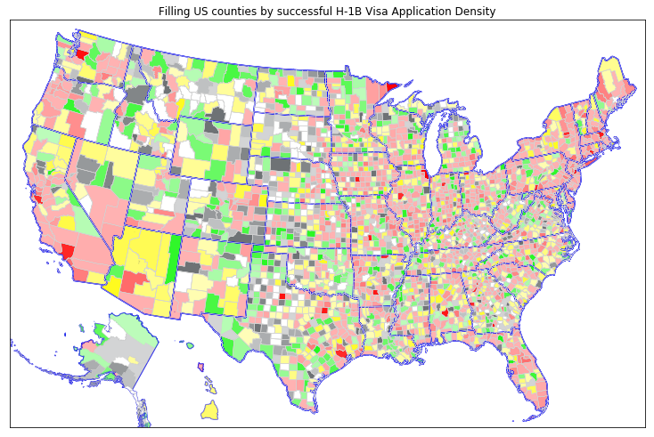

# H-1BVisaApplications
This project cleans, analyses and visualises H-1B (employment-based) visa applications to the USA in the years 2014-2017.

Click on the ipynb file "H-1BVisaApplications.ipynb" to see the notebook. Alternatively click [here](http://htmlpreview.github.com/?https://github.com/BarinderBanwait/H-1BVisaApplications/blob/master/H-1BVisaApplications.html) to see a HTML version, which is cleaner, and renders the plotly interactive graphs. 

Here's the main cool image from the work:

